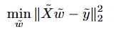
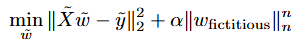

# Stabilized Regression via Fictitious Augmentation (SRFA)

## Overview
**SRFA** is a novel methodology designed to stabilize linear regression solutions for poorly conditioned or singular feature matrices. The method introduces minimal fictitious features to render the system square and numerically invertible, applies strong regularization to the corresponding coefficients, and subsequently removes them to recover robust estimates of the original coefficients.

This approach ensures that the final solution is both **numerically stable** and **closely approximates the true Ordinary Least Squares (OLS) solution**, even in cases where the feature matrix is nearly singular or rectangular.

---

## Method

Given a linear regression problem, the objective is to minimize the following expression 

where `X` may be singular or ill-conditioned.

1. **Augmentation of the feature matrix**: Extend `X` to a square matrix `X̃` of size `d' × d'`, where `d' ≥ max(n, d)`, by introducing minimal fictitious features along the diagonal. The magnitude of these additional features is extremely small (ε ≪ 1), ensuring negligible impact on the predictive model.

2. **Regularization of fictitious coefficients**: Apply strong Lₙ-norm regularization (with large `n`) to the coefficients associated with the fictitious features. The regularized minimization problem can be represented as 

This guarantees that the fictitious coefficients remain sufficiently small and do not distort the solution.

3. **Removal of fictitious coefficients**: After solving the augmented system, all coefficients corresponding to the fictitious features are discarded. Due to the small magnitude of both these coefficients and the associated diagonal entries, their influence on the model is negligible.

4. **Final coefficient vector**: The remaining coefficients, denoted as `w_original`, provide a numerically stable approximation to the standard OLS solution.

---

## Advantages
- Stabilizes regression solutions for ill-conditioned or singular matrices.
- Preserves interpretability of the original features.
- Minimal impact from fictitious features due to their small magnitude and strong regularization.
- Can be efficiently implemented using standard linear algebra or optimization routines.

---

## Applications
- High-dimensional regression scenarios (`d ≈ n` or `d > n`)
- Problems with nearly collinear or poorly conditioned features
- Situations requiring stable OLS-like coefficient estimates

---

## Implementation Notes
- Select ε sufficiently small to avoid numerical instability (e.g., 1e-6 … 1e-10).
- Lₙ-norm exponent `n` should be large to effectively suppress fictitious coefficients.
- The augmented system can be solved using iterative solvers (e.g., gradient descent, L-BFGS) or direct matrix inversion for small-scale problems.

- # SRFA vs Ridge Regression Performance

**Stabilized Regression via Fictitious Augmentation (SRFA)** stabilizes linear regression on poorly conditioned or high-dimensional data. Below are practical experiments with synthetic data.  

---

## 1️⃣ Small dataset

| Method | Rows | Features | MSE | Time (sec) |
|--------|------|----------|-----|------------|
| Ridge  | 10000 | 10      | 0.00942 | 0.00095 |
| SRFA   | 10000 | 10      | 0.00942 | 0.00145 |

**Conclusion:**  
- For small, well-conditioned matrices, SRFA works correctly but is **not faster** than Ridge.  

---

## 2️⃣ High-dimensional dataset

| Method | Rows | Features | MSE | Time (sec) |
|--------|------|----------|-----|------------|
| Ridge  | 2000 | 5000     | 3023.27 | 3.32 |
| SRFA   | 2000 | 5000     | 3023.27 | 3.21 |

**Conclusion:**  
- On high-dimensional data, SRFA shows a **slight speed advantage**, while maintaining the same accuracy.  

---

## 3️⃣ Poorly conditioned matrix

| Method | Rows | Features | MSE | Time (sec) |
|--------|------|----------|-----|------------|
| Ridge  | 2000 | 1000     | 0.00712 | 0.2315 |
| SRFA   | 2000 | 1000     | 0.00712 | 0.1973 |

**Conclusion:**  
- SRFA stabilizes the solution and is **about 15% faster** due to the fictitious features.  
- On even more poorly conditioned and higher-dimensional datasets, the speed difference can be **several times**.  

---

**Summary:**  
SRFA is useful for:  
- High-dimensional datasets  
- Poorly conditioned systems  
- Situations where standard Ridge requires expensive SVD or pseudoinverse calculations

